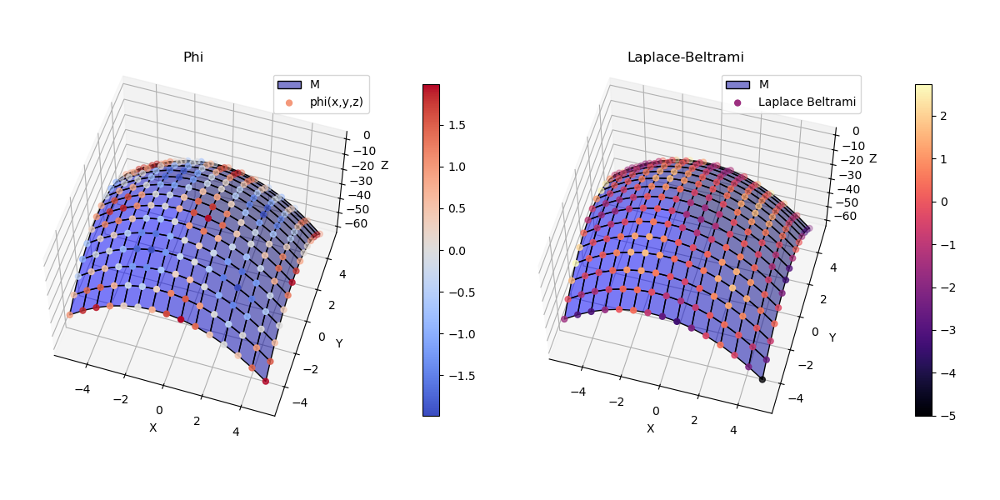
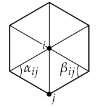

# Laplace-Beltrami
In `differential geometry`, the Laplace–Beltrami operator is a generalization of the `Laplace operator` to functions defined on submanifolds in Euclidean space and, even more generally, on Riemannian and pseudo-Riemannian manifolds. It is named after Pierre-Simon Laplace and Eugenio Beltrami. [Wikipedia](https://en.wikipedia.org/wiki/Laplace%E2%80%93Beltrami_operator)

$$\Delta f = div\left( \nabla f\right)$$

> The Laplace–Beltrami operator, like the Laplacian, is the (Riemannian) divergence of the (Riemannian) gradient.



## Cotangent laplacian

In practice, a very simple discretization can actually work quite well—especially on fine triangulations with “nice” elements (e.g., those that satisfy the so-called Delaunay condition). A standard choice is to use the 2-dimensional [cotangent formula](https://www.cs.cmu.edu/~kmcrane/Projects/Other/nDCotanFormula.pdf):

```math
$$\left(L\phi\right)_i := \frac{1}{2}\sum_{ij}\left( \cot \alpha_{ij} + \cot \beta_{ij} \right)\left( \phi_j  - \phi_i \right)$$
```

In other words: the Laplacian of the function u at vertex $i$ is obtained by summing up the difference across all edges $ij$ incident on $i$, weighted by the sum of the cotangents of the two interior angles $\alpha_{ij}$, $\beta_{ij}$ opposite $ij$



## Partial differential equations
It can be used for solving/approximating the [poisson equation](https://en.wikipedia.org/wiki/Poisson%27s_equation), [diffusion equation](https://en.wikipedia.org/wiki/Diffusion_equation), [heat equation](https://en.wikipedia.org/wiki/Heat_equation), [wave equation](https://en.wikipedia.org/wiki/Wave_equation) or any other equation which involves the `laplacian`.